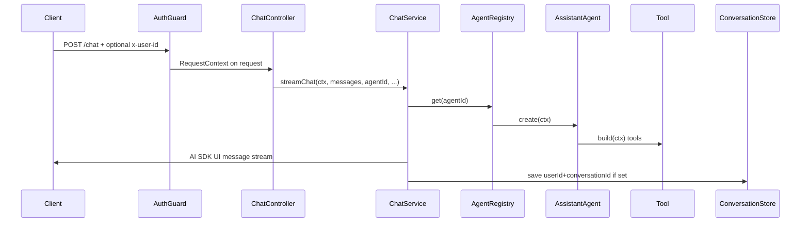

# Lesson 1 - Project structure

This template splits agent work into layers so HTTP, models, tools, and domain logic do not tangle. When something breaks, you usually know which folder to open.

## Folder map

```
src/
  agents/     what the agent is for (instructions, tools, step limits) + AgentRegistry
  tools/      domain capabilities as Nest providers
  chat/       HTTP, streaming, conversation persistence
  model/      AI provider selection (openai | anthropic | ollama)
  config/     boot-time env validation
  health/     liveness endpoint
  common/     request identity, guards, error mapping
  app.module.ts
  main.ts
```

| Layer | Owns | Must not own |
|-------|------|----------------|
| `agents/` | Instructions, which tools an agent gets, step limits, registry ids | HTTP routes, persistence, provider API keys |
| `tools/` | Domain calls scoped to the current user | Controllers, agent instructions |
| `chat/` | Controllers, DTOs, streaming to the client, `ConversationStore` | Tool implementations, model config |
| `model/` | Building a `LanguageModel` from env | Agents or tools |
| `config/` | Env schema / fail-fast validation | Feature logic |
| `health/` | Liveness | Feature logic |
| `common/` | `RequestContext`, auth stub, global filters | Feature business logic |

## Why the split exists

Most AI SDK demos put everything in one Next.js route handler. That is fine for a demo. In a real Nest backend you already have services, auth, and tests. This layout keeps:

- **Agents** ignorant of Express/`@Res()` - they only create a `ToolLoopAgent`.
- **Tools** as injectables that can use your existing services, always built with `RequestContext` so they cannot act for the wrong user.
- **Chat** as the only place that knows about HTTP status codes, abort signals, and saving messages.

There is no global tool registry. An agent only sees the tools you pass into `create()` in that agent file.

## Request path (one chat turn)



1. [`AuthGuard`](../../src/common/auth.guard.ts) reads identity (`x-user-id` in `AUTH_MODE=dev`) and attaches `RequestContext`.
2. [`ChatController`](../../src/chat/chat.controller.ts) validates the body with [`ChatRequestDto`](../../src/chat/chat.dto.ts) and wires abort-on-disconnect.
3. [`ChatService`](../../src/chat/chat.service.ts) resolves the agent via [`AgentRegistry`](../../src/agents/agent.registry.ts) and pipes the UI stream to the response.
4. [`AssistantAgent`](../../src/agents/assistant.agent.ts) creates a `ToolLoopAgent` with tools from [`OrderLookupTool`](../../src/tools/order-lookup.tool.ts) / [`ListOrdersTool`](../../src/tools/list-orders.tool.ts), each `build(ctx)`.
5. If `conversationId` was sent, finished messages are saved via [`CONVERSATION_STORE`](../../src/chat/conversation-store.ts) keyed by **userId + conversationId**.

`GET /conversations/:id` only hits the store for the current user and returns JSON - no agent run.

## Module wiring

[`AppModule`](../../src/app.module.ts) imports, in order of dependency:

`ConfigModule` → `CommonModule` → `HealthModule` → `ModelModule` → `ToolsModule` → `AgentsModule` → `ChatModule`

`ChatModule` imports `AgentsModule` and registers the controller. Tools are exported from `ToolsModule` and injected into agents - not into the controller.

## Takeaway

HTTP lives in `chat/`. Intelligence lives in `agents/`. Domain side effects live in `tools/`. Identity lives in `common/`. Keep new code in the layer that matches that ownership.
