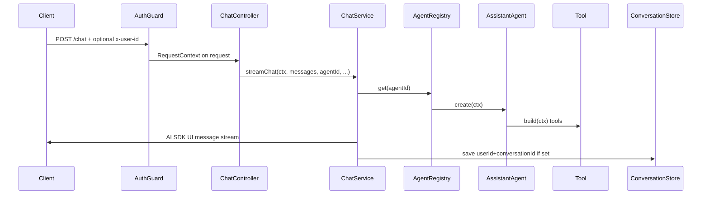
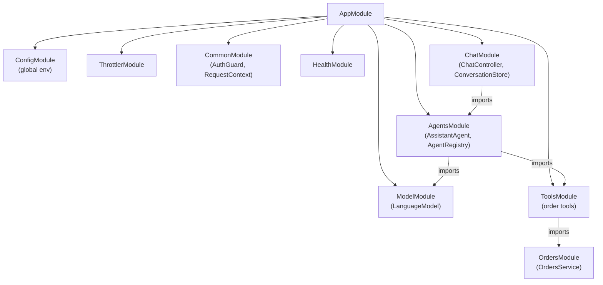

# Lesson 1 - Project structure

This template splits agent work into layers so HTTP, models, tools, and domain logic do not tangle. When something breaks, you usually know which folder to open.

## Folder map

```
src/
  agents/     what the agent is for (instructions, tools, step limits) + AgentRegistry
  tools/      AI SDK tool wrappers (`build(ctx)`) that call domain services
  orders/     sample domain (`OrdersService`) - keep tools thin
  chat/       HTTP, streaming, conversation persistence
  model/      AI provider selection (openai | anthropic | ollama)
  config/     boot-time env validation
  health/     liveness endpoint
  common/     request identity, guards, error mapping
  app.module.ts
  main.ts
```

| Layer | Owns | Must not own |
|-------|------|----------------|
| `agents/` | Instructions, which tools an agent gets, step limits, registry ids, returning a `ToolLoopAgent` from `create()` | HTTP routes, `@Res()` / Express `Response`, persistence, provider API keys |
| `tools/` | AI SDK `tool()` wrappers scoped to the current user via `ctx` | Controllers, agent instructions, domain persistence |
| `orders/` | Sample domain logic (`OrdersService`) | HTTP, agents, AI SDK tools |
| `chat/` | Controllers, DTOs, streaming to the client, `ConversationStore` | Tool implementations, model config |
| `model/` | Building a `LanguageModel` from env | Agents or tools |
| `config/` | Env schema / fail-fast validation | Feature logic |
| `health/` | Liveness | Feature logic |
| `common/` | `RequestContext`, auth stub, global filters | Feature business logic |

## Why the split exists

Most AI SDK demos put everything in one Next.js route handler. That is fine for a demo. In a real Nest backend you already have services, auth, and tests. This layout keeps each concern in one place:

- **Agents** only configure intelligence. An agent class injects tools/model providers and, in `create(ctx)`, returns a new AI SDK `ToolLoopAgent` (instructions, tools, step limit). It does not import Express, does not take `@Res()`, and does not write bytes to the HTTP response. If you feel the urge to stream from an agent file, put that code in `chat/` instead.
- **Tools** are Nest injectables that call your existing services. Each tool is built per request with `RequestContext`, so execute handlers always run as the current user.
- **Chat** is the HTTP boundary: controllers, `@Res()` streaming, abort-on-disconnect, status codes, and conversation persistence. It looks up an agent by id, calls `create(ctx)`, and pipes the UI message stream to the client.

There is no global tool registry. An agent only sees the tools you pass into `create()` in that agent file.

## Request path (one chat turn)



### 1. AuthGuard: attach `RequestContext`

[`AuthGuard`](../../src/common/auth.guard.ts) runs before the controller. In `AUTH_MODE=dev` it reads `x-user-id` (default `demo-user`), builds a [`RequestContext`](../../src/common/request-context.ts), and hangs it on the request so later layers can inject it with `@CurrentContext()`.

```ts
const userId =
  mode === 'jwt'
    ? await this.userIdFromVerifiedJwt(request)
    : mode === 'jwt-stub'
      ? this.userIdFromUnsignedJwt(request)
      : this.userIdFromDevHeader(request);

const ctx: RequestContext = { requestId, userId };
```

### 2. Controller: validate body, abort on disconnect

[`ChatController`](../../src/chat/chat.controller.ts) takes a validated [`ChatRequestDto`](../../src/chat/chat.dto.ts) body, the current context, and an Express `@Res()`. Client disconnect aborts the agent run so you do not keep spending tokens after the browser closes.

```ts
async chat(
  @Body() body: ChatRequestDto,
  @CurrentContext() ctx: RequestContext,
  @Req() req: Request,
  @Res() res: Response,
): Promise<void> {
  const abortController = new AbortController();
  const onClose = () => abortController.abort();
  req.on('close', onClose);

  try {
    await this.chatService.streamChat({
      ctx,
      messages: body.messages,
      conversationId: body.conversationId,
      agentId: body.agentId,
      response: res,
      abortSignal: abortController.signal,
    });
  } finally {
    req.off('close', onClose);
  }
}
```

### 3. ChatService: resolve agent, stream UI protocol

[`ChatService`](../../src/chat/chat.service.ts) looks up the agent by id in [`AgentRegistry`](../../src/agents/agent.registry.ts), calls `create(ctx)`, and pipes the AI SDK UI message stream onto the Express response. This is the only layer that touches `@Res()`.

```ts
const agent = this.agents.get(agentId).create(ctx);
const uiMessages = ensureMessageIds(messages);

await pipeAgentUIStreamToResponse({
  response,
  agent,
  uiMessages,
  abortSignal,
  onFinish: async ({ messages: finalMessages, isAborted, finishReason }) => {
    // ... metrics + optional save (step 5)
  },
});
```

### 4. Agent: `ToolLoopAgent` + per-request tools

[`AssistantAgent`](../../src/agents/assistant.agent.ts) does not stream. It only builds a `ToolLoopAgent` with instructions, a step limit, and tools from [`ListOrdersTool`](../../src/tools/list-orders.tool.ts) / [`OrderLookupTool`](../../src/tools/order-lookup.tool.ts) / [`CancelOrderTool`](../../src/tools/cancel-order.tool.ts). Each tool is `build(ctx)` so execute handlers close over the current user.

```ts
create(ctx: RequestContext, model?: LanguageModel) {
  return new ToolLoopAgent({
    model: model ?? this.modelService.getModel(),
    instructions: /* ... */,
    tools: {
      listOrders: this.listOrders.build(ctx),
      lookupOrder: this.orderLookup.build(ctx),
      cancelOrder: this.cancelOrder.build(ctx),
    },
    stopWhen: stepCountIs(MAX_STEPS),
  });
}
```

### 5. Optional persistence

If the client sent `conversationId`, `onFinish` saves the finished message list through [`CONVERSATION_STORE`](../../src/chat/conversation-store.ts). The key is always **userId + conversationId**, so histories cannot leak across accounts.

```ts
if (!conversationId) {
  return;
}
await this.conversations.save(
  ctx.userId,
  conversationId,
  finalMessages,
);
```

`GET /conversations/:id` only hits the store for the current user and returns JSON - no agent run.

## Module wiring

[`AppModule`](../../src/app.module.ts) boots the app. Feature modules declare the real edges: `ChatModule` imports `AgentsModule`; `AgentsModule` imports `ModelModule` and `ToolsModule`; `ToolsModule` imports `OrdersModule`. Tools are injected into agents - not into the controller.



## Takeaway

| Put new code in… | When it owns… |
|------------------|---------------|
| `chat/` | HTTP: routes, DTOs, streaming, persistence |
| `agents/` | Intelligence: instructions, tool wiring, step limits |
| `tools/` | AI SDK tool wrappers that call domain services |
| `orders/` | Domain: orders lookups and mutations |
| `common/` | Identity: `RequestContext`, auth, shared guards/filters |

If a change fits more than one row, split it - do not stretch a layer past its ownership.

Next: [Adding features](./02-adding-features.md).
